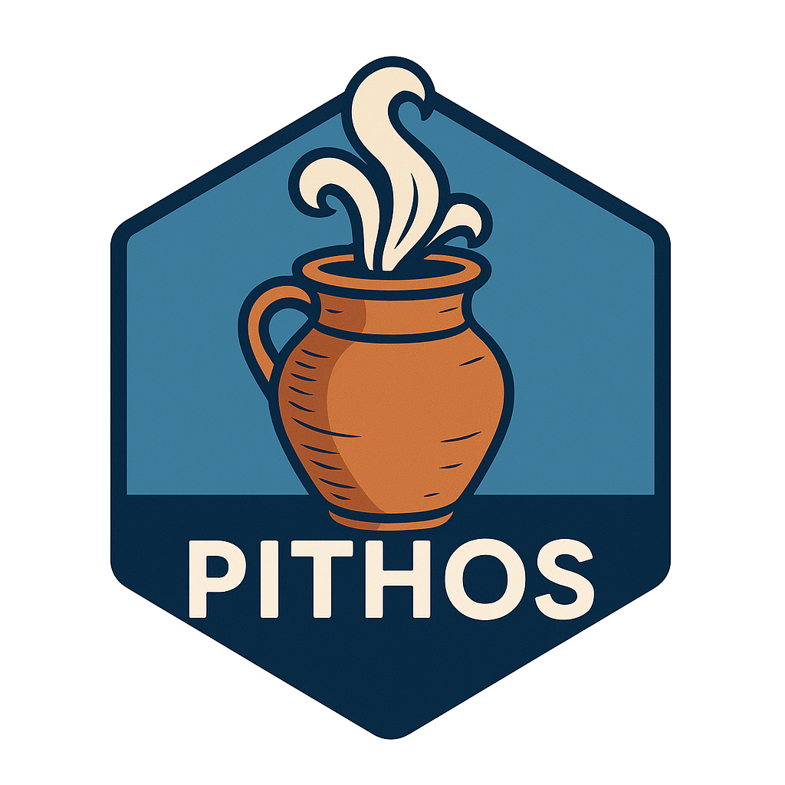

# Pithos 

### Practical, tidy, GIS-friendly utilities for R

**Pithos** (Greek: *πίθος*, “jar”) is a lightweight toolbox of general and spatial utilities used across analytical and data-engineering workflows.  
Its functions are designed to be short, composable, and pipe-friendly, following a clean naming convention with the prefix `pndr.` — a reference to *Pandora reaching into Pithos*.

---

## Features

- **Spatial clustering** — `pndr.dbscan_cluster()` runs DBSCAN on `sf` POINT layers or raw data frames and returns labeled data plus concave hull polygons.
- **Convenient scaling helpers**  
  - `pndr.as_x100()` — express a value as “x per 100 of t”.  
  - `pndr.x100of()` — compute the actual value given a percentage of a total.
- **Development helper** — `pndr.doc_pckg()` wraps `devtools::document()`, `build_site()`, and `install()` for fast local builds.

All functions are written with strict syntax, minimal dependencies, and explicit geometry handling for robust use in GIS and R pipelines.

---

## Installation

```r
# install the development version
devtools::install_github("mrosas47/pithos")
```

To load:
```r
library(pithos)
```

---

## Example usage

### DBSCAN clustering
```r
library(sf)
library(pithos)

pts <- st_as_sf(
  data.frame(x = rnorm(200), y = rnorm(200)),
  coords = c("x", "y"), crs = 4326
)

res <- pndr.dbscan_cluster(pts, eps = 0.02, min_pts = 5, concavity = 0.5)
plot(st_geometry(res$hulls))
table(res$data$cluster)
```

### Percentage utilities
```r
pndr.as_x100(25, 200)
#> 12.5

pndr.x100of(12.5, 200)
#> 25
```

### Rapid package iteration
```r
# Run documentation, site build, and installation
pndr.doc_pckg()
```

---

## Dependencies

| Package  | Purpose                  |
|-----------|--------------------------|
| **sf**    | spatial geometries       |
| **dbscan**| clustering               |
| **lwgeom**| concave hull computation |
| **devtools** | documentation, install |
| *(optional)* **pkgdown** | site building |

---

## Etymology

> *Pithos* (πίθος): the large earthenware jar from which Pandora’s gifts (and troubles) escaped.  
> In this package, it’s a jar of small, practical R tools — once opened, you’ll find exactly what you need (and hopefully nothing catastrophic).

---

## License

MIT © [Martín Rosas Araya]

---

## Author

Maintained by **Martín Rosas Araya**
